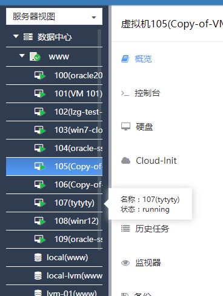
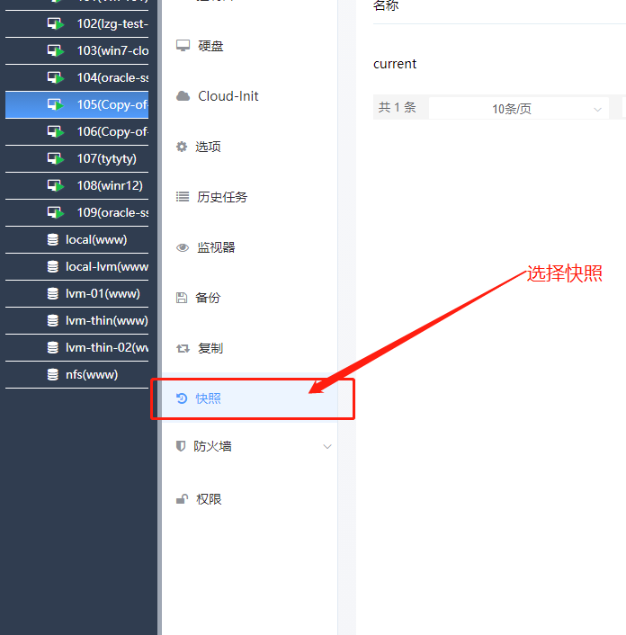
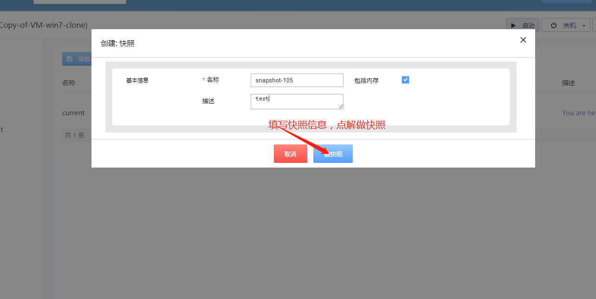
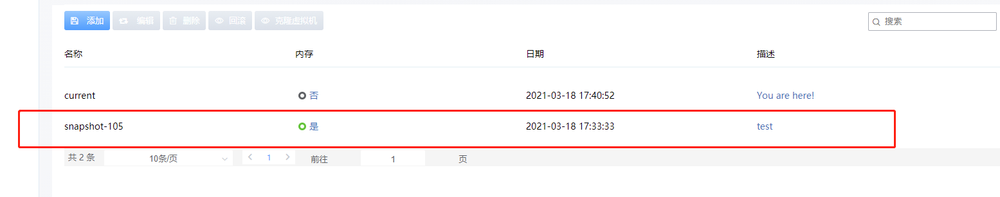
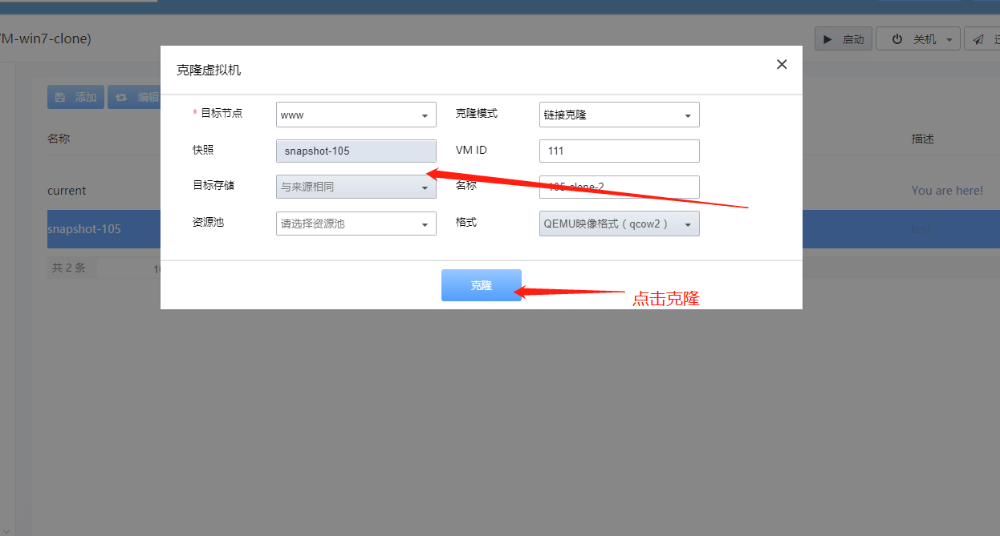
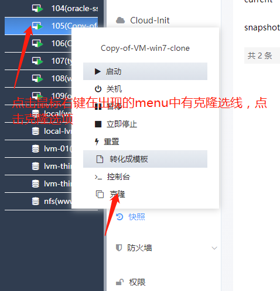
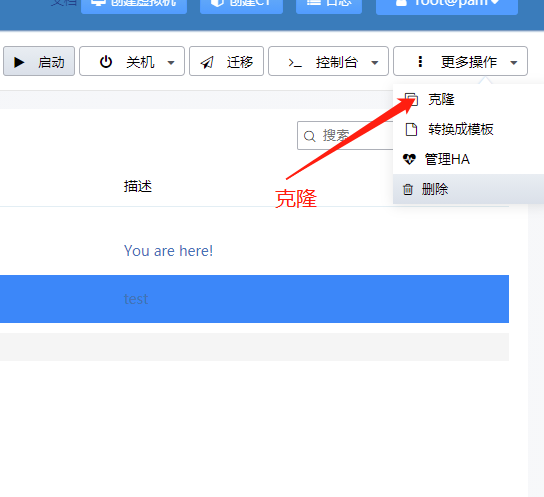

<h1>快照克隆步骤</h1>
<h2>步骤1、创建快照</h2>

点击任意一个qemu虚拟机

  
<h2>步骤2、选择快照</h2>

<h2>步骤3、创建快照</h2>

快照创建成功后

<h2>步骤4、克隆虚拟机</h2>
<ul>
   <li>
     方法1、直接选择快照列表页的克隆虚拟机，填写信息，点击克隆
     
   </li>
   <li>
     
方法2、在已知创建了快照的条件下右键要克隆的虚拟机在出现的menu中选择克隆

     

     

     

   </li>
   <li>
     方法3、直接选择右上角更多操作，选择克隆填写信息，点击克隆
      

      

   </li>
</ul>
<h2>步骤5、点击克隆</h2>
<h2>步骤6、选择左侧克隆出的虚拟机，点击在右上角再继续，启动克隆出的虚拟机<h2>

